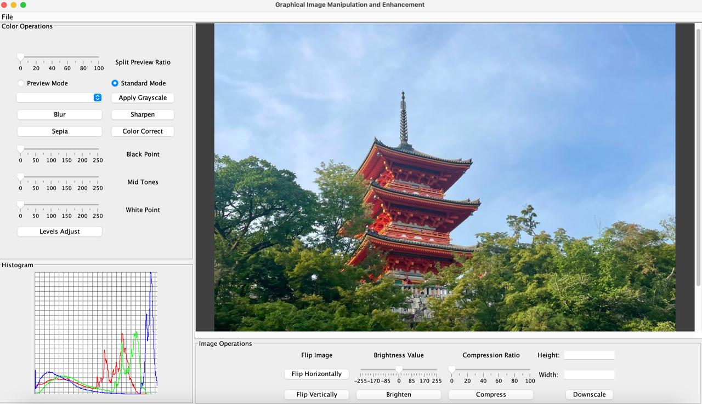
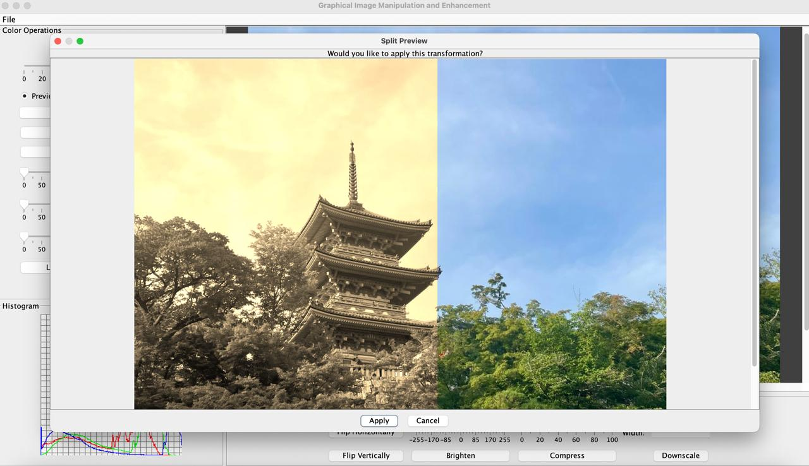

# Using Graphical User Interface

### To Run the Program in GUI Mode:
`java -jar a6.jar`

### File Menu Panel

- **Load Image:** To load an image, click on File > Load Image button select an image file from the file dialog, and click Open.
- **Save as:** To save the image, click on File > Save As button, and choose a destination and format for the file (PPM, PNG & JPG supported).
- **Undo:** To undo an operation, click on File > Undo button.
- **Exit:** To exit the application, click on File > Exit.

### Color Operations Panel
These operations support split preview.
#### Options provided:

- **Preview Mode**: For viewing the effect of color adjustments before applying.
- **Grayscale**: Choose the grayscale type needed from the dropdown provided. Once apply button is clicked, the grayscale operation is performed.
- **Blur**: Apply a blur filter to the image by clicking on the button.
- **Sharpen**: Apply a sharpen filter to the image by clicking on the button.
- **Sepia**: Apply a sepia filter to the image by clicking on the button.
- **Color Correct**: Apply a sepia filter to the image by clicking on the button.
- **Adjust Black, Mid, White**: Adjust the black, mid, and white levels of the image by toggling the sliders provided. Once levels adjust button is clicked, the operation is performed.

### Histogram Panel
The histogram panel on the bottom left of the application shows the live histogram of the image.

### Image Preview Panel
The image preview panel on the top right of the application displays the image once loaded. It keeps updating after every operation performed by the user.

### Image Operations Panel
These operations do not support the split preview.
#### Options provided:

- **Horizontal Flip**: Horizontal flip performed by clicking the button.
- **Vertical Flip**: Vertical flip performed by clicking the button.
- **Brighten**: The value of the brightness can be adjusted with the help of the slider provided. The values are between -255 to 255.
- **Compress**: The compression ratio can be adjusted with the slider provided. The values are between 0 and 100.
- **Downscale**: The height and width of the downscaled image can be provided through the text box. After downscale button is clicked, the image is resized.

### GRIME GUI

### Split Preview

# Using Interactive CLI and Script modes:

### To Run in Script File mode:
`java -jar a6.jar -file path-of-script-file`  

### To Run in Interactive CLI mode:
`java -jar a6.jar -text`  

Our program supports a split view of an image (to preview an operation). This split view is supported by the commands: blur, sharpen, sepia, grayscale, color-correct, and levels-adjust. For more information, refer to point 22.    
Additionally, we support partial image manipulation for commands: blur, sharpen, grayscale, sepia and component visualizations. Refer point 24.

### 1. `load image-path image-name`
This command is responsible for loading an image into our application. It supports the file formats: png, jpg, ppm. An image with the same image-name will be overwritten.  
`image-path`: the relative/absolute file path of the image to be loaded. 
`image-name`: a variable name that will be used to refer to this image. 

### 2. `save image-path image-name`
This command is responsible for saving an image from the application into the file system. It supports the file formats: png, jpg, ppm.  
`image-path`: the relative/absolute file path where the image must be saved.  
`image-name`: the variable name of the image in our application, that is to be saved.

### 3. `red-component image-name dest-image-name`
A greyscale operation that sets all component values to the red value. This visualizes the red component of the image.  
`image-name`: the name of the image on which the operation will take place.  
`dest-image-name`: the name of the resulting image.

### 4. `green-component image-name dest-image-name`
A greyscale operation that sets all component values to the green value. This visualizes the green component of the image.  
`image-name`: the name of the image on which the operation will take place.  
`dest-image-name`: the name of the resulting image.

### 5. `blue-component image-name dest-image-name`
A greyscale operation that sets all component values to the blue value. This visualizes the blue component of the image.  
`image-name`: the name of the image on which the operation will take place.  
`dest-image-name`: the name of the resulting image.

### 6. `value-component image-name dest-image-name`
A greyscale operation that sets all component values to the maximum of all. This visualizes the value component of the image.  
`image-name`: the name of the image on which the operation will take place.  
`dest-image-name`: the name of the resulting image.

### 7. `luma-component image-name dest-image-name`
A greyscale operation that applies a luma filter on each pixel of the image. This visualizes the luma component of the image.  
`image-name`: the name of the image on which the operation will take place.  
`dest-image-name`: the name of the resulting image.

### 8. `intensity-component image-name dest-image-name`
A greyscale operation that sets all component values to the average of the component values. This visualizes the intensity component of the image.  
`image-name`: the name of the image on which the operation will take place.  
`dest-image-name`: the name of the resulting image.

### 9. `horizontal-flip image-name dest-image-name`
Flips the image horizontally.  
`image-name`: the name of the image on which the operation will take place.  
`dest-image-name`: the name of the resulting image.

### 10. `vertical-flip image-name dest-image-name`
Flips the image vertically.  
`image-name`: the name of the image on which the operation will take place.  
`dest-image-name`: the name of the resulting image.

### 11. `brighten increment image-name dest-image-name`
If the increment is positive, this command brightens the image. If the increment is negative, it will darken the image. This is done by adding the given constant value to all components of the image. If the increment or decrement exceeds the bounds of the pixel value, it uses the max value (255 or -255, depending on the sign of the increment). 
`increment`: an integer between -255 and 255 which represents the amount to be brightened by. 
`image-name`: the name of the image on which the operation will take place.  
`dest-image-name`: the name of the resulting image.

### 12. `rgb-split image-name dest-image-name-red dest-image-name-green dest-image-name-blue`
Split the given image into three images containing its red, green, and blue components respectively. The split images will appear as if they have been tinted, since each image only shows its respective component. 
`image-name`: the name of the image on which the operation will take place.  
`dest-image-name-red`: the name of the resulting red image. 
`dest-image-name-green`: the name of the resulting green image. 
`dest-image-name-blue`: the name of the resulting blue image.

### 13. `rgb-combine image-name red-image green-image blue-image`
Combines the three images that are individually red, green and blue into a single image that gets its red, green and blue components from the three images respectively. 
`image-name`: the name of the resulting.  
`red-image`: the name of the red tinted image. 
`green-image`: the name of the green tinted image. 
`blue-image`: the name of the blue tinted image.

### 14. `blur image-name dest-image-name`
Blur the given image and store the result in another image with the given name.  
`image-name`: the name of the image on which the operation will take place.  
`dest-image-name`: the name of the resulting image.

### 15. `sharpen image-name dest-image-name`
Sharpen the given image and store the result in another image with the given name.  
`image-name`: the name of the image on which the operation will take place.  
`dest-image-name`: the name of the resulting image.

### 16. `sepia image-name dest-image-name`
Produce a sepia-toned version of the given image and store the result in another image with the given name.  
`image-name`: the name of the image on which the operation will take place.  
`dest-image-name`: the name of the resulting image.

### 17. `run script-file`
Load and run the script commands in the specified file. 
`script-file`: the relative/absolute file path of script.

### 18. `compress percentage image-name dest-image-name`
Creates a compressed version of the image. The percentage dictates the amount of compression, and it must lie in the range 0 to 100. If it exceeds these bounds, it will be set to the max/min value respectively.  
`percentage`: an integer between 0 and 100 that represents the amount to be compressed by. 
`image-name`: the name of the image on which the operation will take place.  
`dest-image-name`: the name of the resulting image.

### 19. `histogram image-name dest-image-name`
Produces a 256 x 256 image that represents a histogram of the given image. It contains histograms for the red, green, and blue channels as line graphs.  
`image-name`: the name of the image on which the operation will take place.  
`dest-image-name`: the name of the resulting image, the histogram.

### 20. `color-correct image-name dest-image-name`
Color corrects an image by aligning the meaningful peaks of its histogram.
`image-name`: the name of the image on which the operation will take place.  
`dest-image-name`: the name of the color corrected image.

### 21. `levels-adjust b m w image-name dest-image-name`
Adjusts the black, mid, and white values of the image. The values must be in ascending order and within the range 0 and 255. 
`b`: the black value. Must be lesser than the other two values. 
`m`: the middle value. Must be lesser than the white value and greater than the black value. 
`w`: the white value. Must be greater than the other two values. 
`image-name`: the name of the image on which the operation will take place.  
`dest-image-name`: the name of the levels adjusted image.

### 22. `function image-name dest-image-name split p`
Function can refer to any of the following: blur, sharpen, sepia, greyscale, color-correct, and levels-adjust. This is a command to preview an image transformation using a split view of the image. The left side of the image would show the transformed image and the right side would show the original image. p specifies the ratio of the split, and must lie between 0 and 100.  
`image-name`: the name of the image on which the operation will take place.  
`dest-image-name`: the name of the resulting split view image.  
`p`: an integer between 0 and 100 that represents what proportion of the image will be transformed.

### 23. `downscale new-height new-width image-name dest-image`
Downscales the image to the specified dimensions given. The method adjusts the pixel data of the current image to match the new height and width. The new dimensions have to be the same as the original image.  
`new-height`: new height to be downscaled.  
`new-width`: new width to be downscaled.  
`image-name`: the name of the image on which the operation will take place.  
`dest-image-name`: the name of the resulting downscaled image.  

### 24. `function image-name mask-image dest-image-name`
`image-name`: the name of the image on which the operation will take place.  
`mask-image`: the name of the mask image.  
`dest-image-name`: the name of the resulting partially manipulated image.  